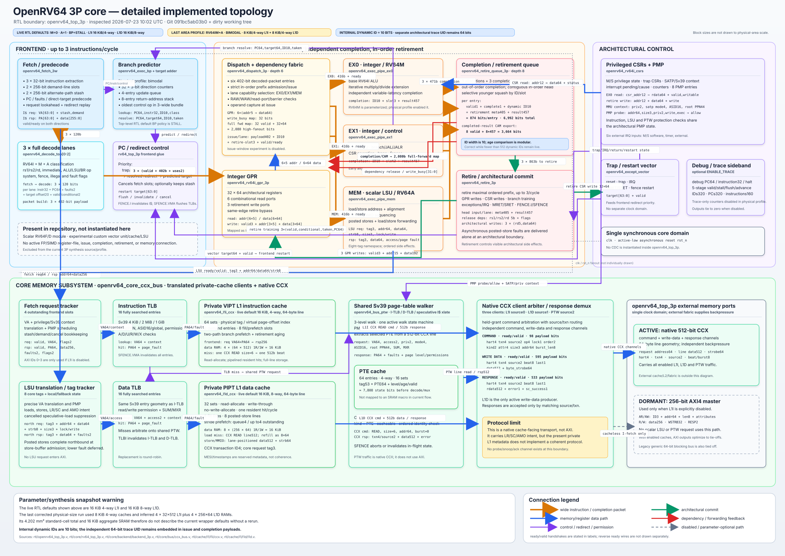

# OpenRV64 3P detailed block diagram

## What was inspected, and when (UTC)

| Item | Value |
|---|---|
| Inspection | Live RTL hierarchy and interface-width audit |
| Inspected | 2026-07-23 10:02:15 UTC |
| Source | Git `091bc5ab03b0`, with a dirty working tree |
| Boundary | `openrv64_top_3p` |
| Core topology | Three-wide fetch/decode/issue/retire, EX0/EX1/MEM |
| ISA parameters | Live default `M=0`, `A=1`; last physical profile enabled RV64M+A |
| Main memory path | Native ready/valid CCX, 512-bit line data |
| Diagram | [`openrv64-core-block-diagram.svg`](openrv64-core-block-diagram.svg) |

The SVG is intentionally large and zoomable. It documents the implemented RTL,
not a floorplan, and block dimensions are not proportional to physical area.



## Important snapshot differences

The live wrapper defaults and the last corrected physical-size run are not the
same configuration:

| Item | Live RTL default | Last corrected size run |
|---|---:|---:|
| L1I | 16 KiB, 4-way | 8 KiB, 4-way |
| L1I data RAM | 4 x 64 x 512 | 4 x 32 x 512 |
| L1D | 16 KiB, 8-way | 8 KiB, 4-way |
| L1D data RAM | 8 x 256 x 64 | 4 x 256 x 64 |
| Aggregate L1 data capacity | 32 KiB | 16 KiB |

Consequently, the previous **4.202 mm2 standard-cell logic plus 16 KiB inferred
SRAM** result cannot be assigned to the current wrapper defaults without
rerunning synthesis.

Internal dynamic instruction IDs are now 10 bits from predictor lookup through
dispatch, execution, completion, redirect, and retirement. The separate
architectural trace UID embedded in issue/completion payloads remains 64 bits.
Age tests use modular subtraction, so the 1023-to-0 wrap remains ordered while
fewer than half of the 1,024-ID namespace can be live. The configured queues
are far below that 512-ID limit.

## Wide interfaces and coupling

| Producer -> consumer | Type | Implemented payload |
|---|---|---:|
| Fetch -> decode | 3-lane decoupled packet | 3 x 120 bits |
| Decode/packet build -> dispatch | 3-lane decoupled packet | 3 x (402 payload + 2 source-use flags) |
| Dispatch -> each execution lane | held ready/valid issue | 402 payload + 10 ID + 3 slot + valid = 416 bits/lane |
| Each execution lane -> retirement queue | held ready/valid completion | 457 result + 10 ID + 3 slot + valid = 471 bits/lane |
| Retirement queue -> retire | ordered head prefix | 405 metadata + 457 result + valid = 863 bits/lane |
| GPR -> dispatch | combinational read | 6 x 64 data, selected by 6 x 5-bit addresses |
| Retire -> GPR | architectural commit | 3 x (valid + 5-bit address + 64-bit data) |
| Completed entries -> backend forwarding | completion CAM export | 8 valid + 8 x 457 = 3,664 bits |
| Backend forwarding map -> dispatch | high-fanout operand bypass | 32 valid + 32 x 64 = 2,080 bits |
| MEM -> memory subsystem | tagged decoupled LSU request | tag3, address64, data64, strobe8, size3, lock/write |
| Fetch -> memory subsystem | decoupled line request | address64, stash/demand; response address64 + data256 |

The eight-entry retirement queue stores, per entry:

```text
valid 1 + complete 1 + dynamic ID 10 + metadata 405 + result 457
= 874 bits/entry
= 6,992 bits across eight entries
```

The ID reduction removes 432 stored bits from the eight-entry retirement queue:
54 bits per entry. The remaining 96-bit excess over `(405 + 457) x 8` is the
10-bit identity plus two status bits per entry. The much wider metadata and
result payloads remain the dominant issue.

## External memory protocols

The enabled-cache configuration sends L1I, L1D, and PTW traffic through three
independent ready/valid CCX channels:

| Channel | Payload |
|---|---:|
| Command | 98 bits: hart4, transaction4, source2, operation4, lock1, order2, kind2, attributes4, size3, address64, burst length8 |
| Write data | 595 bits: hart4, transaction4, source2, beat8, last1, data512, byte strobe64 |
| Response | 533 bits: hart4, transaction4, source2, beat8, last1, data512, error1, SC-success1 |

The 256-bit AXI4 master remains in the top-level pinout but is active only for
explicit cacheless-L1I operation. Scalar LSU and PTW traffic do not use AXI.
The legacy 64-bit blocking bus is tied off by `openrv64_top_3p`.

## Source RTL

- [`rtl/openrv64_top_3p.v`](../../rtl/openrv64_top_3p.v)
- [`rtl/core/rv64_top_3p.v`](../../rtl/core/rv64_top_3p.v)
- [`rtl/core/backend/backend_3p.v`](../../rtl/core/backend/backend_3p.v)
- [`rtl/core/backend/backend-defs.v`](../../rtl/core/backend/backend-defs.v)
- [`rtl/core/dispatch/dispatch_3p.v`](../../rtl/core/dispatch/dispatch_3p.v)
- [`rtl/core/exec/exec_top_3p.v`](../../rtl/core/exec/exec_top_3p.v)
- [`rtl/core/retire/retire_queue_3p.v`](../../rtl/core/retire/retire_queue_3p.v)
- [`rtl/core/bus/ccx_bus.v`](../../rtl/core/bus/ccx_bus.v)
- [`rtl/cache/l1/l1i/ccx.v`](../../rtl/cache/l1/l1i/ccx.v)
- [`rtl/cache/l1/l1d/l1d.v`](../../rtl/cache/l1/l1d/l1d.v)
- [`rtl/complex/protocol/defs.v`](../../rtl/complex/protocol/defs.v)
